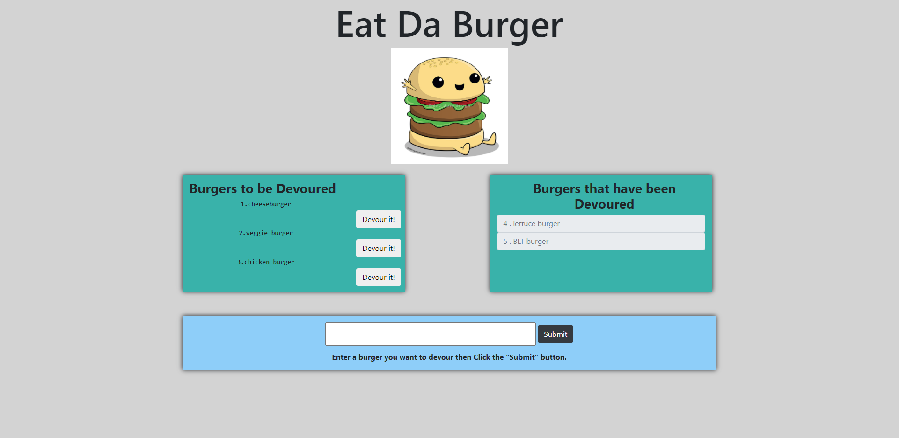

# burger

# Table of Contents

* [Process](#Process)
* [Issues](#Issues)
* [Video](#Video)
* [Link](#Link)
* [Screenshot](#Screenshot)

# Process

First type in a buger name and hit submit button and the page will upload.

Next the name will appear on the left side with also a devour it button.

Next click the devour it button and the webpage will upload again and

the burger name will appear on the right side that it has been devoured.

# Issues

The issues I had was the amount of files going back and forth to make sure my code lined up properly.

jumping to models folder to server.js to controllers folder even with different tabs was stressful to make sure 

that each code lined up perfectly to get the website to operate.

Next would be setting up the orm in the handlebars with the curly braces, I had to look over many of my

in class assignments to make sure I was setting everything correctly which added to longer time of working on the assignment.

The start was easy having the instructions how to set up and setting up some of the simpler files such as 

server.js and connection.js but taking all that information and making it work in the handlebars was tedious and if not

paying close attention some simple spelling errors made life hard. In the end re reading each line of code

helped me fixed my small mistakes.

# Link 

[Link to Heroku site](https://gluttony-of-burgers.herokuapp.com/)

# Screenshot

